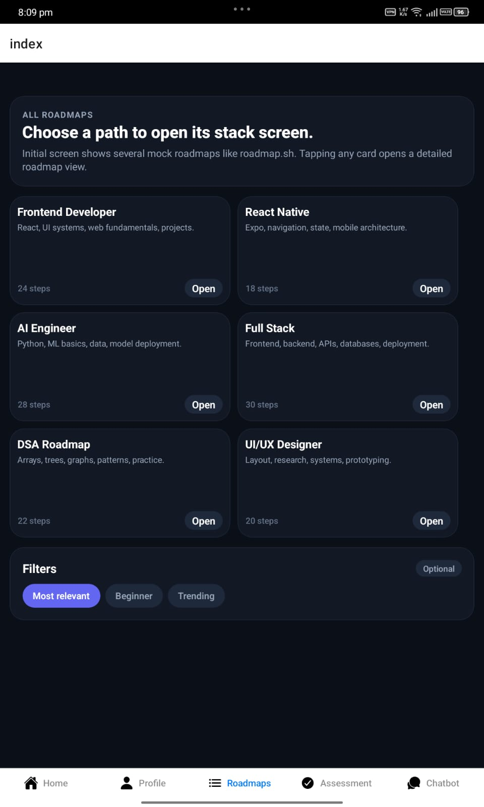
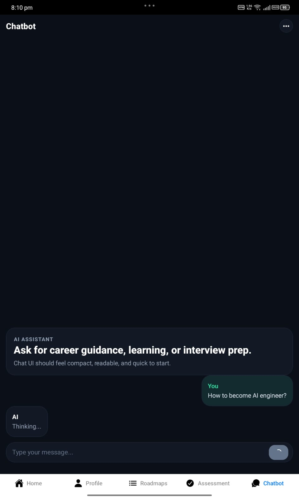
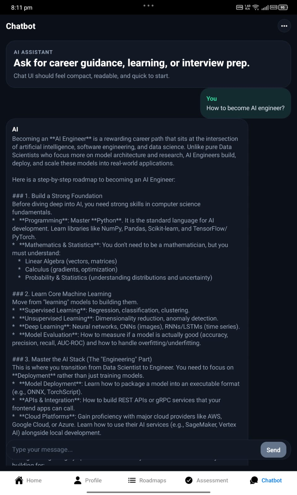
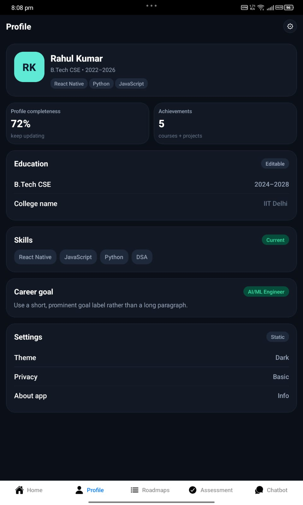
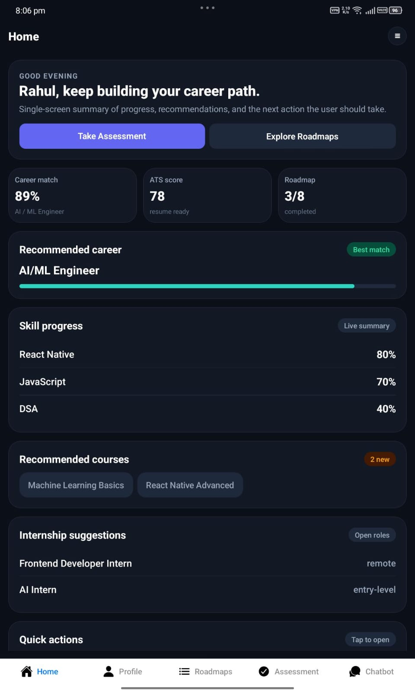

# App Design ( currently )








Here is a comprehensive `README.md` file tailored to your React Native (Expo) project based on the provided source code.

***

# Career Path AI Assistant 🚀

A modern, cross-platform mobile application built with **React Native** and **Expo Router**. This app serves as an intelligent career companion, offering resume analysis (ATS scoring), personalized learning roadmaps, skill assessments, and an AI-powered chatbot for career guidance.

## ✨ Features

### 1. 🏠 Home Dashboard
- **Personalized Greeting**: Dynamic header based on time of day.
- **Career Metrics**: Visual summary of Career Match %, ATS Score, and Roadmap progress.
- **Recommendations**: AI-suggested career paths, skill progress tracking, and relevant courses/internships.
- **Quick Actions**: Fast access to Assessment, Resume, Chatbot, and Profile sections.

### 2. 📄 Resume & ATS Analyzer (`assessment.tsx`)
- **Multi-Format Support**: Upload `.pdf`, `.docx`, or `.txt` files.
- **On-Device Text Extraction**:
  - Uses `JSZip` to parse `.docx` XML structures.
  - Custom regex-based parser for extracting text from `.pdf` binary data.
- **AI-Powered Analysis**: Simulates integration with LLMs (Groq/Cerebras) to provide:
  - **ATS Score**: 0-100 scoring.
  - **Breakdown**: Formatting, Keywords, and Projects quality.
  - **Actionable Suggestions**: High/Medium/Low priority improvements.

### 3. 💬 AI Chatbot (`chatbot.tsx`)
- **Conversational Interface**: Clean, inverted FlatList UI for real-time chatting.
- **Context-Aware**: Maintains conversation history for coherent responses.
- **Suggested Prompts**: One-tap starters for common queries (e.g., "How to become an AI Engineer?").
- **Session Management**: Option to clear chat history via a modal.
- **Local/Cloud AI Ready**: Configured endpoint structure for connecting to local LLMs (e.g., LM Studio) or cloud APIs.

### 4. 👤 User Profile (`profile.tsx`)
- **User Info**: Display name, degree, and quick skill tags.
- **Progress Tracking**: Visual metrics for profile completeness and achievements.
- **Education & Skills**: Editable sections for academic background and technical skills.
- **Career Goals**: Clear display of target roles (e.g., AI/ML Engineer).
- **Settings**: Theme toggling (Light/Dark mode support) and privacy controls.

### 5. 🗺️ Roadmaps *(Placeholder in Tab Layout)*
- Dedicated tab for structured learning paths (implementation details to be added).

## 🛠️ Tech Stack

- **Framework**: [React Native](https://reactnative.dev/) with [Expo](https://expo.dev/)
- **Navigation**: [Expo Router](https://docs.expo.dev/router/introduction/) (File-based routing)
- **Icons**: [@react-native-vector-icons/ionicons](https://github.com/oblador/react-native-vector-icons)
- **State Management**: React Hooks (`useState`, `useEffect`)
- **Styling**: StyleSheet with custom Theme support (Light/Dark mode)
- **Utilities**:
  - `expo-document-picker`: For file uploads.
  - `jszip`: For parsing `.docx` files.
  - `expo/fetch`: For network requests.

## 📂 Project Structure

```text
├── app/
│   ├── _layout.tsx       # Root layout with Tab Navigation
│   ├── index.tsx         # Home Screen
│   ├── assessment.tsx    # Resume Upload & ATS Analysis
│   ├── profile.tsx       # User Profile & Settings
│   └── chatbot.tsx       # AI Chat Interface
├── theme/
│   └── theme.ts          # Centralized colors, spacing, and border radius
└── README.md
```

## 🚀 Getting Started

### Prerequisites
- Node.js (v18+)
- Expo CLI
- iOS Simulator / Android Emulator or Physical Device

### Installation

1. **Clone the repository**
   ```bash
   git clone <your-repo-url>
   cd <project-directory>
   ```

2. **Install dependencies**
   ```bash
   npm install
   # or
   yarn install
   ```

3. **Install specific packages if missing**
   ```bash
   npx expo install expo-document-picker jszip react-native-safe-area-context @react-native-vector-icons/ionicons
   ```

4. **Start the development server**
   ```bash
   npx expo start
   ```

## 🎨 Theming

The app supports **Light** and **Dark** modes automatically based on the system preference.
- Theme definitions are located in `@/theme/theme`.
- Components use `useColorScheme()` hook to dynamically apply styles.

## 🔮 Future Improvements

- [ ] Connect `assessment.tsx` to a real Backend/API for live ATS scoring.
- [ ] Implement persistent storage (AsyncStorage/Supabase) for user profiles and chat history.
- [ ] Add actual content to the **Roadmaps** tab.
- [ ] Implement authentication flow (Login/Signup).

## Get started

1. Install dependencies

   ```bash
   npm install
   ```

2. Start the app

   ```bash
   npx expo start
   ```

In the output, you'll find options to open the app in a

- [development build](https://docs.expo.dev/develop/development-builds/introduction/)
- [Android emulator](https://docs.expo.dev/workflow/android-studio-emulator/)
- [iOS simulator](https://docs.expo.dev/workflow/ios-simulator/)
- [Expo Go](https://expo.dev/go), a limited sandbox for trying out app development with Expo

You can start developing by editing the files inside the **app** directory. This project uses [file-based routing](https://docs.expo.dev/router/introduction).

## Get a fresh project

When you're ready, run:

```bash
npm run reset-project
```

This command will move the starter code to the **app-example** directory and create a blank **app** directory where you can start developing.

### Other setup steps

- To set up ESLint for linting, run `npx expo lint`, or follow our guide on ["Using ESLint and Prettier"](https://docs.expo.dev/guides/using-eslint/)
- If you'd like to set up unit testing, follow our guide on ["Unit Testing with Jest"](https://docs.expo.dev/develop/unit-testing/)
- Learn more about the TypeScript setup in this template in our guide on ["Using TypeScript"](https://docs.expo.dev/guides/typescript/)

## Learn more

To learn more about developing your project with Expo, look at the following resources:

- [Expo documentation](https://docs.expo.dev/): Learn fundamentals, or go into advanced topics with our [guides](https://docs.expo.dev/guides).
- [Learn Expo tutorial](https://docs.expo.dev/tutorial/introduction/): Follow a step-by-step tutorial where you'll create a project that runs on Android, iOS, and the web.

## Join the community

Join our community of developers creating universal apps.

- [Expo on GitHub](https://github.com/expo/expo): View our open source platform and contribute.
- [Discord community](https://chat.expo.dev): Chat with Expo users and ask questions.
